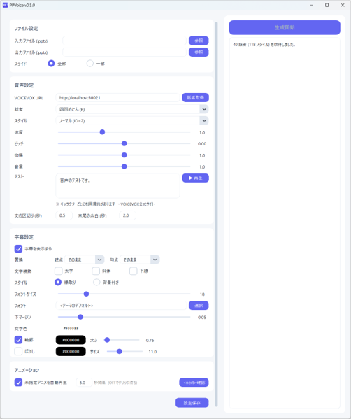

# PPVoice

PowerPointのノート欄から音声を自動合成し、**音声付きPPTX**を生成するツールです。

音声合成には [VOICEVOX](https://voicevox.hiroshiba.jp/) を使用します。

## 主な機能

- **音声付きPPTX生成** — スライドごとにノートを読み上げる音声を埋め込み、自動再生を設定
- **字幕** — 読み上げテキストをスライド上に字幕として表示（タイミング同期）。字幕スタイルは縁取り（輪郭・ぼかし）・半透明背景から選択可能。太字・斜体・下線のデフォルト設定や句読点の置換にも対応
- **アニメーション連携** — `<next>` タグで音声タイムラインに合わせてクリックアニメーションを自動発火
- **テスト再生** — GUI上で音声と字幕をプレビュー確認
- **読み指定** — `{漢字|よみがな}` の記法でTTSに渡す読みと表示テキストを分離
- **設定の保存・復元** — `<config>` タグでPPTXファイルに設定を埋め込み、次回自動読み込み
- **ドラッグ＆ドロップ** — PPTXファイルをウィンドウにドロップして入力

## デモ

PPVoice で生成した音声付きスライドの紹介動画です（クリックで再生）。この動画自体も PPVoice で作成されています。





## 必要なもの

- [VOICEVOX Engine](https://voicevox.hiroshiba.jp/) (ローカルで起動しておく)

> **注意**: VOICEVOXのキャラクターにはそれぞれ利用規約があります。使用前に [VOICEVOX公式サイト](https://voicevox.hiroshiba.jp/) で確認してください。

VOICEVOX互換APIを持つ [SelfVox](https://github.com/Yasuaki-Ito/selfvox) も利用できます。SelfVox は Qwen3-TTS による音声クローン合成ツールで、自分の声のサンプルを登録するだけで、その声で読み上げができます。VOICEVOX URL を SelfVox のアドレスに変更するだけで切り替えられます。

## インストール

[Releases](../../releases) ページから最新の `PPVoice-x.x.x-setup.exe` をダウンロードして実行してください。

## 使い方

### 1. PowerPoint のノート欄にテキストを書く

PPVoice はスライドの **ノート欄** に書かれたテキストを読み上げます。PowerPoint でスライド下部の「ノートを入力」欄に、読み上げたい内容を記入してください。

- ノートが空のスライドは音声なし（スキップ）になります
- テキストは改行ごとに分割されて合成されます
- 改行がなければノート全体が1つの音声チャンクになります

### 2. VOICEVOX Engine を起動する

PPVoice を使う前に、[VOICEVOX](https://voicevox.hiroshiba.jp/) を起動しておいてください。デフォルトで `http://localhost:50021` に接続します。

### 3. PPVoice で音声を生成する

インストール後、スタートメニューまたはデスクトップの **PPVoice** から起動できます。入力ファイルの選択、話者・字幕の設定をGUI上で行えます。PPTXファイルはドラッグ＆ドロップでも入力できます。

### 4. (オプション) 動画に変換する

PPVoice で生成した音声付きPPTXは、PowerPoint の標準機能で動画に変換できます。

1. 生成されたPPTXファイルを PowerPoint で開く
2. **ファイル → エクスポート → ビデオの作成** を選択
3. 「記録されたタイミングとナレーションを使用する」を選択
4. **ビデオの作成** をクリック

音声とスライド切り替えのタイミングが保持されたMP4が生成されます。

## 読み指定の記法

ノート内で `{表示テキスト|読み}` と書くと、字幕には「表示テキスト」が表示され、VOICEVOXには「読み」が渡されます。

```
{PPTX|パワーポイント}ファイルを読み込みます。
```

→ 字幕: "PPTXファイルを読み込みます。"
→ 読み上げ: "パワーポイントファイルを読み込みます。"

`{` や `}` 単体は `{...|...}` のパターンに該当しない限りそのまま表示されるため、エスケープは不要です。

### アクセント指定

VOICEVOXの読み上げでアクセント（音の高低）が正しくない場合、3番目のパラメータで修正できます。

```
{橋|はし|2}を渡る。
```

番号は声の高さが下がる位置を表します。例えば「はし」（2文字）の場合:

| 番号 | 高低パターン |
|---|---|
| `0` | は↗**し** （上がったまま） |
| `1` | **は**↘し |
| `2` | は↗**し**↘ （後続の助詞等で下がる） |

番号を `0` から順に変えてテスト再生し、正しく聞こえるものを選んでください。指定できる番号の範囲は `0` 〜 読みの文字数です（「きょ」「しゃ」等の拗音は1文字として数えます）。

例として
```
{端|はし|0}を歩く。
{箸|はし|1}を持つ。
{橋|はし|2}を渡る。
```
という感じで音声が合成されます。
基本的には0,1,2,...と変え、しっくりくるのを探してください。

## 字幕の書式指定

ノート内でHTMLライクなタグを使い、字幕テキストの一部に装飾を付けられます。タグは大文字・小文字どちらでも使えます。

| タグ | 効果 |
|---|---|
| `<b>...</b>` | 太字 |
| `<i>...</i>` | 斜体 |
| `<u>...</u>` | 下線 |
| `<color=#RRGGBB>...</color>` | 文字色 |
| `<font=フォント名>...</font>` | フォント変更 |
| `<br>` | 字幕内の改行 |
| `<size=N>...</size>` | フォントサイズ変更（絶対: `<size=24>`, 相対: `<size=+4>`, `<size=-2>`） |
| `<speed=N>` | 読み上げ速度を変更（`<speed=1.5>` で1.5倍速。文単位で適用） |
| `<pitch=N>` | ピッチを変更（`<pitch=0.1>`, `<pitch=-0.05>` など。文単位で適用） |
| `<intonation=N>` | 抑揚を変更（デフォルト 1.0。`<intonation=0.5>` で抑揚を抑える。文単位で適用） |
| `<volume=N>` | 音量を変更（デフォルト 1.0。`<volume=0.5>` で音量を下げる。文単位で適用） |
| `<wait=N>` | 無音を挿入（`<wait=1s>`, `<wait=500ms>` など）。前後で文が分割され、字幕も別々になる |
| `<next>` | クリックアニメーションを発火（下記参照） |
| `<config ...>` | GUI設定の保存・読み込み（下記参照） |

```
これは<color=#FF0000>重要な</color>ポイントです。
<b><u>注意事項</u></b>を確認してください。
```

タグは読み上げには影響しません（TTSにはタグを除いたテキストが渡されます）。`{<b>}` のように `{...}` で囲むとタグがエスケープされ、そのまま表示されます。

## アニメーション連携 (`<next>` タグ)

スライドに設定されたクリック時アニメーション（mainSeq）を、音声の読み上げタイミングに合わせて自動発火できます。ノートに `<next>` と書くと、その位置に対応するクリックアニメーションが発火します。

```
最初の説明です。
<next>
ここでアニメーションが出ます。
```

→ 「最初の説明です」の読み上げ後にクリックアニメーション1が発火、続けて次の文を読み上げ

文の途中に書くこともできます。

```
ここで<next>アニメーションが出ます。
```

→ 文字数の比率からタイミングを推定し、読み上げ途中でアニメーションが発火

`<next>` の数よりクリックアニメーションが多い場合、余ったアニメーションは「未指定アニメを自動再生」が有効なら設定間隔で順次発火します。`<next>` が多い場合、余った `<next>` は無視されます。

## デフォルト文字装飾

GUI の字幕設定で「文字装飾」の **太字**・**斜体**・**下線** のチェックボックスを切り替えると、字幕全体のデフォルトスタイルを変更できます。ノート内の `<b>`, `<i>`, `<u>` タグによる個別指定はデフォルト設定に加えて適用されます。

## 句読点の置換

字幕に表示される句読点を別の文字に置き換えることができます。GUI の「置換」で読点グループ（`、` `，` `,`）と句点グループ（`。` `．` `.`）それぞれの変換先を選択できます。`{...}` で囲まれたテキスト内の句読点は置換の対象外です。

## 設定の保存 (`<config>` タグ)

GUI の「設定保存」ボタンを押すと、現在の話者・字幕スタイルなどの設定を `<config ...>` タグとしてコピーできます。このタグを PPTX の任意のスライドのノート欄に貼り付けておくと、次回ファイルを開いた際に設定が自動的に復元されます。

```
<config speaker="ずんだもん" style="ノーマル" pause=0.5 fontsize=18 subtitle_style=outline bold=off italic=off underline=off>
```

必要なキーだけを書けば部分的に設定を上書きできます。複数のスライドにタグがある場合は後のタグが優先されます。

## ライセンス

MIT
