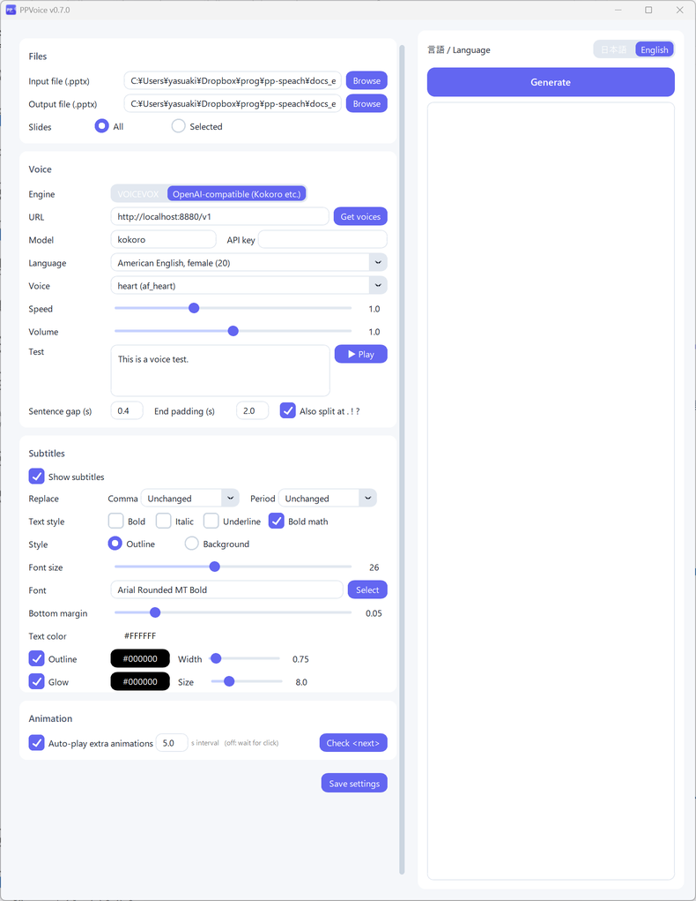

# PPVoice

PPVoice turns the **speaker notes** of a PowerPoint file into narration and generates a **narrated PPTX**. The generated file can be exported to video with PowerPoint's built-in feature.

[Download (latest)](https://github.com/Yasuaki-Ito/PPVoice/releases/latest){ .md-button .md-button--primary }
[Getting started](getting-started.md){ .md-button }

## Features

- **Narrated PPTX** — Embeds narration audio in each slide and sets up auto-play and automatic slide transitions
- **Choice of TTS engines** — [VOICEVOX](https://voicevox.hiroshiba.jp/) (Japanese) or an OpenAI-compatible TTS server such as Kokoro-FastAPI (English and more)
- **Subtitles** — Shows subtitles synchronized with the narration, with outline or background styles, text color, fonts, and more
- **Animation sync** — Write `<next>` in the notes to play click animations at that point in the narration
- **Pronunciation and math** — Write `{PPTX|P P T X}` to separate the subtitle text from what is spoken, and `{$x^2$|x squared}` to show math in subtitles
- **Test playback** — Check the voice and subtitles in the app before generating
- **Saved settings** — Store voice and subtitle settings in the notes of the PPTX and restore them automatically next time
- **Japanese and English UI** — Switch the language at the top right of the window

## Demo

A video made with PPVoice, narrated in English with Kokoro. Click to play.

## License

MIT License. The source code is available on [GitHub](https://github.com/Yasuaki-Ito/PPVoice).

!!! note "Terms of use for voices"
    The terms of use for synthesized speech depend on the TTS engine and the voice. For VOICEVOX characters, see the [VOICEVOX website](https://voicevox.hiroshiba.jp/).
