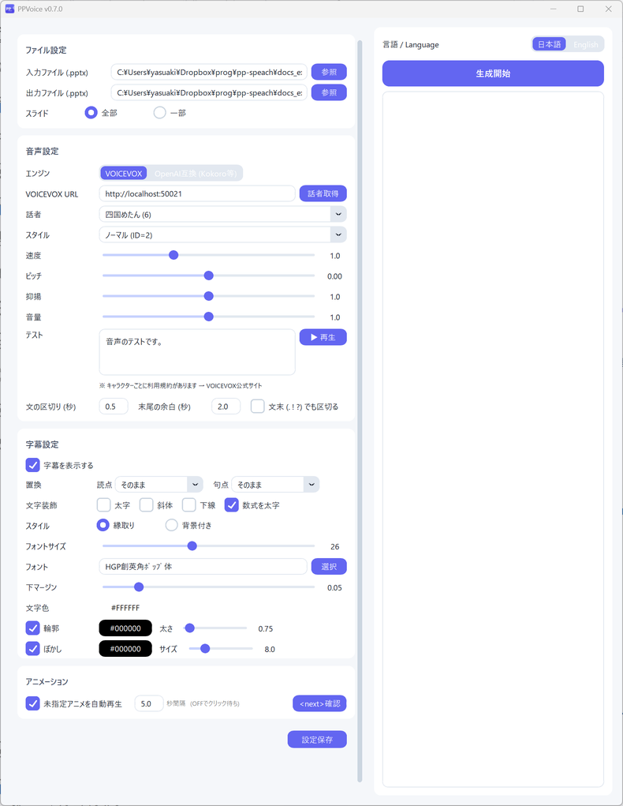

# PPVoice

PowerPoint のノート欄から音声を自動で合成し、**音声付き PPTX** を生成するツールです。生成した PPTX は、PowerPoint の標準機能でそのまま動画にできます。

[ダウンロード（最新版）](https://github.com/Yasuaki-Ito/PPVoice/releases/latest){ .md-button .md-button--primary }
[はじめかた](getting-started.md){ .md-button }

## できること

- **音声付き PPTX の生成** — スライドごとにノートを読み上げる音声を埋め込み、自動再生とスライドの自動切り替えを設定します
- **音声合成エンジンの選択** — 日本語の [VOICEVOX](https://voicevox.hiroshiba.jp/) と、Kokoro-FastAPI などの OpenAI 互換 TTS（英語など）を切り替えられます
- **字幕** — 読み上げに合わせてスライドに字幕を表示します。縁取り・背景付きのスタイル、文字色、フォントなどを設定できます
- **アニメーション連携** — ノートに `<next>` と書くと、読み上げのタイミングに合わせてクリックアニメーションを再生します
- **読み指定・数式** — `{PPTX|パワーポイント}` のように表示と読みを分けて書けます。`{$x^2$|エックスにじょう}` で字幕に数式を表示できます
- **テスト再生** — 生成前に GUI 上で音声と字幕を確認できます
- **設定の保存** — 話者や字幕の設定を PPTX のノートに保存し、次回開いたときに自動で復元します

## デモ

PPVoice で作った紹介動画です（クリックで再生）。この動画自体も PPVoice で作成しています。

## ライセンス

MIT License。ソースコードは [GitHub](https://github.com/Yasuaki-Ito/PPVoice) で公開しています。

!!! note "音声の利用規約"
    合成した音声の利用条件は、音声合成エンジンやキャラクターごとに異なります。VOICEVOX のキャラクターの利用規約は [VOICEVOX 公式サイト](https://voicevox.hiroshiba.jp/) で確認してください。
